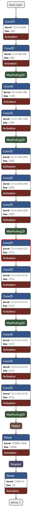
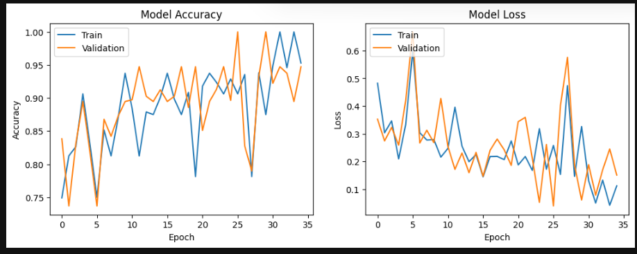
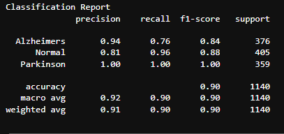

# Neurodegenerative Disease Detection

## Overview
This project aims to detect neurodegenerative diseases, specifically Alzheimer's and Parkinson's, using MRI images and deep learning techniques. The model is built using the VGG16 architecture and trained on an augmented dataset to enhance its robustness and accuracy.

Kaggle Notebook link - https://www.kaggle.com/toshall/neurodegenerative-disease-insight
## Dataset
The dataset consists of MRI images categorized into three groups:

Dataset link - https://www.kaggle.com/datasets/toshall/neurodegenerative-diseases
- **Alzheimer's Disease**: MRI scans of patients diagnosed with Alzheimer's.
- **Parkinson's Disease**: MRI scans of patients diagnosed with Parkinson's.
- **Normal**: MRI scans of healthy individuals.

## Data Augmentation
To balance the dataset and improve model performance, various data augmentation techniques were applied, including:

- Rotation
- Shearing
- Zooming
- Horizontal flipping
- Brightness adjustment
- Width and height shifting

## Model
The model leverages the pre-trained VGG16 network, a well-known Convolutional Neural Network (CNN) architecture, excluding the top layer. Custom layers were added on top of VGG16 for this specific classification task.

## Performance
The model was trained and evaluated using the augmented dataset, achieving an accuracy of approximately 93% on the test set.
heh1.png

## How to Use
1. **Install Dependencies**: Install the necessary Python libraries.
2. **Run Preprocessing**: Execute the preprocessing script to prepare and augment the dataset.
3. **Train the Model**: Run the training script to train the model on the processed data.
4. **Evaluate the Model**: Use the evaluation script to test the model and visualize its performance.

## Acknowledgements
This project utilizes MRI images obtained from various sources, including publicly available datasets. Data augmentation and preprocessing were applied to balance the dataset and enhance model performance.

## License
This project is licensed under the MIT License.

For detailed instructions and code, please refer to the project's main repository.
